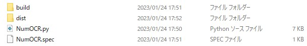
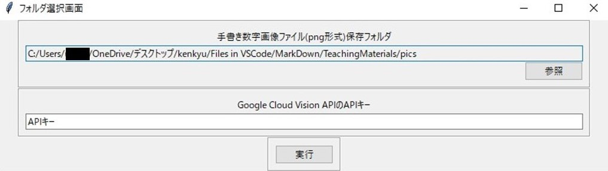
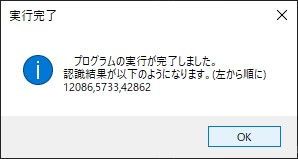

# メニュー*
##  概要*
Google CloudのVision APIを用いて, 手書き数字の画像認識デスクトップアプリを開発します。
尚, Cloud Vision APIの使用前設定には, クレジットカードの登録が必要です。ただ, 本デスクトップアプリの使用により, 料金がかかることはありません。＊料金の発生・その他トラブルに関しては, 責任は負いかねます。予めご了承下さい。

## 学べること*
このレシピは以下の手法を学ぶことができます。
* 入力画面(GUI)の作成方法
* Cloud Vision APIの使用方法
* exe化の方法

## 始める前のスキルセット*
* Pythonの言語と基本構文の理解

## 実務活用例*
この手書き数字の画像認識デスクトップアプリを用いることで, OCRを行うことができます。
従って, このアプリは業務効率化・自動化に活用できます。
 <活用例>
 [OCR導入で業務改善を～活用例4選をご紹介| リコー](https://www.ricoh.co.jp/service/cloud-ocr/column/ocruse/)

# キッチン*
## 開発環境*
* Visual Studio Code
  
## ツール*
* Python
* pyinstaller

# 調理*

## Cloud Vision APIの使用前設定*

下の参考サイトの内容のように, 使用前設定を行い, APIキーを取得します。尚, Cloud Vision APIの使用前設定には, クレジットカードの登録が必要です。ただ, 本デスクトップアプリの使用により, 料金がかかることはありません。＊料金の発生・その他トラブルに関しては, 責任は負いかねます。予めご了承下さい。
<参考サイト>
[Cloud Vision APIの使い方まとめ (サンプルコード付き)](https://syncer.jp/cloud-vision-api)

## ライブラリインポート*

手書き数字が写った画像ファイルを格納しているフォルダ読み込み用, 入力画面・メッセージ用, Cloud Vision APIでの画像認識用に次のようにライブラリをインポートします。

    #画像ファイルを格納しているフォルダ読み込み用
    import os
    import glob

    #入力画面・メッセージ用
    import tkinter as tk
    from tkinter import ttk
    from tkinter import filedialog
    from tkinter import messagebox

    #Cloud Vision APIでの画像認識用
    import requests
    import base64
    import json

## フォルダ選択・APIキー入力画面*

以下のサイトを参考に, フォルダ選択・APIキー入力画面作成機能を実装します。
尚, 関数reinitializationを用いて, 入力不足・不適切な入力に対応出来る設計をします。
<参考サイト1>
[【Python】tkinterでファイル&フォルダパス指定画面を作成する](https://qiita.com/dgkmtu/items/2367a73f7e2d498e6075)
<参考サイト2>
[[Python] Tkinterのボタンが押された時に引数付き関数を呼び出したい。｜株式会社アースリンク](https://www.earthlink.co.jp/engineerblog/technology-engineerblog/7744/)
<参考サイト3>
[Tkinterの階層構造とフレーム（Frame）](https://denno-sekai.com/tkinter-frame/)

    class NumOCR:
        def __init__(self):
            self.IDDataFiles=[]
            self.inputs=[]
            # rootの作成
            self.root = tk.Tk()
            self.makeGUI()

        def makeGUI(self):
            #tkのGUI画面のタイトル設定
            self.root.title("フォルダ選択画面")
            #GUI画面のサイズ設定
            self.root.geometry('800x200')
            #Frame割り当て用にGUI画面に行列を設定する
            self.root.rowconfigure(index=1, weight=1)
            self.root.rowconfigure(index=2, weight=1)
            self.root.rowconfigure(index=3, weight=1)
            self.root.columnconfigure(index=1, weight=1)
            self.makeFrame(0 ,'手書き数字画像ファイル(png形式)保存フォルダ',True)
            self.makeFrame(1 ,'Google Cloud Vision APIのAPIキー',False)
            frame = ttk.Frame(self.root, padding=10,relief="groove")
            FinishButton = ttk.Button(frame, text="実行", command=lambda:self.getInputButton())
            FinishButton.pack()
            frame.grid(row=2,column=1)
            self.root.mainloop() 

        def makeFrame(self,rowNum,LabelName,ReferOrNot):
            #Frameの作成(Frameを含むシステムの構成について[URL]:https://denno-sekai.com/tkinter-frame/)
            frame = ttk.Frame(self.root, padding=10,relief="groove")
            IDirLabel = ttk.Label(frame, text=LabelName, padding=(5, 2))
            IDirLabel.pack(side=tk.TOP)
            StateType=''
            if LabelName=='手書き数字画像ファイル(png形式)':
                StateType='readonly'
            else:
                StateType='normal'
            IDDataFile = ttk.Entry(frame, textvariable=tk.StringVar(), state=StateType,width=120)
            IDDataFile.pack()
            self.IDDataFiles.append(IDDataFile)
            #この行はラムダ式で模擬関数を定義し, 
            #GUI表示時点による実行を避け, 参照ボタンを押した時のみ実行する仕様に設定(位置:右(下))
            if ReferOrNot:
                IDDataButton = ttk.Button(frame, text="参照", command=lambda:self.referenceButton(False,rowNum))
                IDDataButton.pack(side=tk.RIGHT)
            #gridはrow(column)figureで行列を設定しなければ使えない
            frame.grid(row=rowNum,column=1)

        def referenceButton(self,writeable,positionNum):
            #フォルダーパスの取得
            FolderPath = filedialog.askdirectory(initialdir=os.getcwd())
            if FolderPath:
                if not writeable:
                    self.IDDataFiles[positionNum].configure(state='normal')
                self.IDDataFiles[positionNum].delete(0,tk.END)
                self.IDDataFiles[positionNum].insert(tk.END,FolderPath)
                if not writeable:
                    self.IDDataFiles[positionNum].configure(state='readonly')
        
        def getInputButton(self):
            DestroyJudge=False
            for EntryInput in self.IDDataFiles:
                self.inputs.append(EntryInput.get())
            self.root.withdraw()
            if self.inputs[0]=="" or self.inputs[1]=="":
                messagebox.showerror('入力不足エラー', '全ての欄を入力して下さい。')
                self.reinitialization()            
            else:
                self.root.destroy()
                DestroyJudge=True
            if DestroyJudge==False:
                self.makeGUI()

        def reinitialization(self):
            for EntryInput in self.IDDataFiles:
                EntryInput.delete(0,tk.END)
            self.inputs.clear()
            self.IDDataFiles.clear()
            # rootの再表示
            self.root.deiconify()

## Cloud Vision APIを用いた画像認識*

以下のサイトの内容のように, 読み込んだ画像ファイルから手書きの数字を読み取る, 画像認識機能をCloud Vision APIを用いて, 実装します。尚, APIキーは上で実装した入力画面で入力する仕様にします。
<参考サイト1>
[【Python】GoogleCloudVisionAPIを使って、ホットペッパーの画像で肉々しいお店を判定できないか試してみた - 歩いたら休め ](https://kiito.hatenablog.com/entry/2016/05/14/174149 )
<参考サイト2>
[Google Cloud Vision APIで光学式文字認識](https://qiita.com/AltGuNi/items/6f22f1441733da08fdc1)

    # APIを呼び、認識結果をjson型で返す
    def request_cloud_vison_api(self,image_base64):
        GOOGLE_CLOUD_VISION_API_URL = 'https://vision.googleapis.com/v1/images:annotate?key='
        API_KEY = self.inputs[1]
        api_url = GOOGLE_CLOUD_VISION_API_URL + API_KEY
        req_body = json.dumps({
            'requests': [{
                'image': {
                    # jsonに変換するためにstring型に変換する
                    'content': image_base64.decode('utf-8')
                },
                'features': [{
                    # ここを変更することで分析内容を変更できる
                    'type': 'TEXT_DETECTION',
                    'maxResults': 10,
                }]
            }]
        })
        res = requests.post(api_url, data=req_body)
        return res.json()

    # 画像読み込み
    def img_to_base64(self,filepath):
        with open(filepath, 'rb') as img:
            img_byte = img.read()
        return base64.b64encode(img_byte)

## 認識結果表示*

実行部分を実装します。
具体的には, フォルダ選択・APIキー入力画面の入力を読み込み,
上で実装した関数を用いて, 
フォルダ内の画像ファイルの読み込み, 
画像内の手書き数字を読み取り, 
表示します。
<参考サイト1>
[【Python】GoogleCloudVisionAPIを使って、ホットペッパーの画像で肉々しいお店を判定できないか試してみた - 歩いたら休め ](https://kiito.hatenablog.com/entry/2016/05/14/174149 )
<参考サイト2>
[Google Cloud Vision APIで光学式文字認識](https://qiita.com/AltGuNi/items/6f22f1441733da08fdc1)

    def OutputNum(self):
        if len(self.inputs)!=0:
            ImgPaths=glob.glob(self.inputs[0]+'/*.png')
            if len(ImgPaths)==0:
                messagebox.showerror('ファイルエラー',\
                '選択フォルダ内にPDFファイルはありません。\n'+\
                '選択フォルダをご確認の上, 再度, お試し下さい。')
            else:
                ResultList=[]
                for ImgPath in ImgPaths:
                    # 文字認識させたい画像を設定
                    img_base64 = self.img_to_base64(ImgPath)
                    result = self.request_cloud_vison_api(img_base64)
                    # 認識した文字を出力
                    text_r = result["responses"][0]["textAnnotations"][1]["description"]
                    if text_r!='':
                        ResultList.append(text_r)
                    else:
                        ResultList.append('認識不可')
                messagebox.showinfo('実行完了',
                    '　プログラムの実行が完了しました。\n'+\
                    '認識結果が以下のようになります。(左から順に)\n'+\
                    ','.join(ResultList))

## exe化*

下の参考サイトの内容のように, pyinstallerをインストールした後, 
コマンドプロンプトで以下のコマンドを上から順に入力します。

    cd (開発したPythonファイルのパス)
    pyinstaller (開発したPythonファイルの名前).py --onefile
入力後, 実行すると, 下の画像のように複数のファイル・フォルダが作成されます。その内, フォルダ「dist」内のexeファイルをクリックすると動作が開始されます。

<参考サイト>
[Pythonスクリプトを実行形式(exeファイル)に変換する【Python】](https://biotech-lab.org/articles/9856#Pythonexe)

## 動作確認*

動作が開始されると, 下の入力画面が表示されます。2つの項目を入力し, 「実行」ボタンを押します。

正常に実行された場合, 以下のメッセージ画面が表示され, 数字の認識結果を確認することが出来ます。

